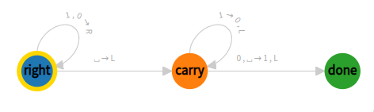

# Macchine di Turing

#### f(x,y) = x + y

#### f(x) = 2x

#### palindomi

#### +1

- right:
    [1,0]: R
    ' '  : {L: carry}
- carry:
    1      : {write: 0, L}
    [0,' ']: {write: 1, L: done}
- done:

#### 3 equal length

$a^n b^n c^n$

- qA:

    a: {write: A, R: qB}

    B: {R: scan}

- qB:

    \[a,B]: R

    b: {write: B, R: qC}

- qC:

    \[b,C]: R

    c: {write: C, L: back}

- back:

    \[a,B,b,C]: L

    A: {R: qA}

- scan:

    \[B,C]: R
    
    ' ': {R: accept}

- accept: