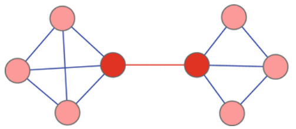

# Data Analytics

1) Structural equivalence (social networks)

Structural equivalence refers to the extend to hich two nodes **are connected to the same others** - i.e., have the same social environments.
It is often hypothesized that structurally equivalent nodes will be similar in other ways as well, such as attitudes, behaviors or performance.

This definition is strict, but we usually refer to a similarity metric of it.

2) Similarity metrics (social networks)

Jaccard, Cosine

3) Diameter of a network

The longest shortes path in a network.

4) Irony

Hard to sistematically detect. Ensemble methods: more supervised models that evaluate an ensemble composition (Bayesian Model Average). DMC: gain/loss per model

5) Sarcasm

Bayesian Model Average

6) Implicit and explicit sentiment

Explicit: *I like apples*

Implicit: *A good guide for starters*

7) How to evaluate a model robustness?

- Accuracy
- Precision
- Recall
- Minimize FP+FN
- ROCs

8) Closeness VS Beetweenes

**Closeness**: Inverse of the sum of the distances (shortest paths) to every other node.

**Betweenees**: Quantity of shortest paths passing by a node

9) ?

10) Named Entity Recognition

Seeks to locate and classify named entity mentioned in unstructured text into pre-defined categories such as person names, organizations, locations, medical codes, time expressions, quantities, monetary values, percentages, etc. 

11) Overfitting VS Underfitting

**Overfitting** the model is too much biased/focused on the training set. Low error on the training but growing on the test

**Underfitting** the learning has not finished

[1](https://medium.com/greyatom/what-is-underfitting-and-overfitting-in-machine-learning-and-how-to-deal-with-it-6803a989c76)

12) Community Detection approaches

##### Node-centric

Each node in a group must satisfy certain properties, such as:

- Complete Mutality
- Reachability of members
- Nodal degress
- ...

##### Group-centric

Each group, as a whole, satisfies some metrics. E.g. group density must be over a set threshold.

##### Network-centric

Partition the network in disjoin subsets.

- K-Means
- Similarity-based clustering
	+ Structural equivalence
	+ Vertex similarities (Jaccard, Cosine)
- Minimum Cut

##### Hierarchic-centric

Build an hierarchical structure (one community in another)

Divisive:

- Recursevely apply Network-centric partitioning
- Edge Betweenness based (iteratevely remove edges with highest betweeness until a network is discomposed into desired number of connected components)

Agglomerative

14) Modularity

A measure of modularity of a network is the number of edges that run between
vertices of the same community minus the number of such edges we would expect
to find if the configuration model is assumed, that is if edges were positioned at
random while preserving the vertex degrees.

15) Sentiment analysis techniques

- Lexicon based
- Semisupervised
- Supervised

16) Edge beetweenes

The edge betweenness centrality is defined as the number of the shortest
paths that go through an edge in a graph or network. Each edge in
the network can be associated with an edge betweenness centrality value. An
edge with a high edge betweenness centrality score represents a bridge-like
connector between two parts of a network, and the removal of which may affect
the communication between many pairs of nodes through the shortest paths
between them.

